# Todo Sessions の機能紹介

Todo Sessions は、todo と Claude Code のセッションをひとつの画面で管理する macOS アプリです。Claude Code を何本も並行して動かしていて、どれが入力待ちなのかをすぐ知りたい人に向けて作っています。

このページでは、どんなことができるかを画面の順に紹介します。細かい動作と設定は [README](../README.md) にまとめています。画像と動画はすべて架空のデモデータで撮っています。

[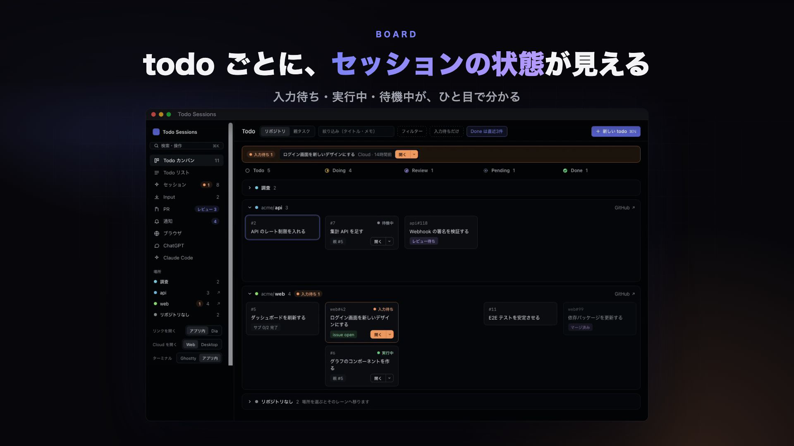](promo.mp4)

紹介動画：[promo.mp4](promo.mp4)（約1分40秒・音声なし）

## できること

- todo ごとに、紐づいた Claude Code のセッションの状態（入力待ち・実行中・待機中）が見えます
- todo から、そのままセッションを始められます。始めたセッションは todo に自動で紐づきます
- GitHub の PR や issue が進むと、todo のステータスも自動で進みます
- PR リストから、レビュー依頼の /review をすぐ始められます
- 入力待ちや作業の完了は通知で知らせます
- 読みたい記事は「Input モード」で、ChatGPT や Claude と並べて読めます
- 操作はほとんどキーボードだけでできます

## しくみ

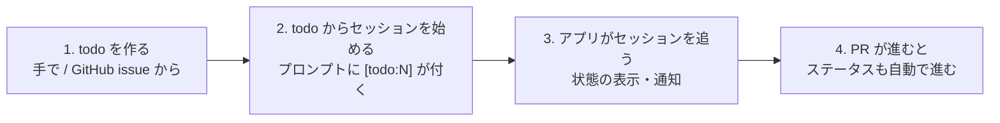

1. **todo を作ります。** ⌘N か「新しい todo」で作ります。⌘K の「issue を取り込む」を使うと、自分に割り当てられた GitHub issue が todo になります。
2. **todo からセッションを始めます。** todo のパネルでプロンプトを書き、起動先（Cloud・Desktop・ターミナル）を選んで始めます。最初のプロンプトには `[todo:N]` が自動で付き、これを目印にセッションが todo に紐づきます。
3. **アプリがセッションを追います。** Claude Code の hook と、クラウドのセッションの同期が、セッションの状態を記録します。入力待ちになると、カードに出て通知も届きます。
4. **PR が進むと、ステータスも進みます。** PR にレビュー依頼が入ると Review、マージされると Done になります。

## 用語

| 用語 | 意味 |
| --- | --- |
| todo | やること1件。GitHub の issue / PR、作業フォルダ、メモ、リンクを持てます |
| セッション | Claude Code の会話1本。CLI・Desktop の Code タブ・クラウドのどれでも扱えます |
| 紐づけ | セッションと todo を結びつけること。最初のプロンプトの `[todo:N]` で自動で行います |
| Cloud / Local | claude.ai のクラウドで動くセッション / 自分の Mac で動くセッション |
| herdr | ターミナルで Claude Code を並べて動かすツール。Local のセッションの起動先のひとつです |
| キュー | 起動待ちの todo の列。上から順に自動で起動します |
| 入力待ち | セッションが止まって、あなたの返事を待っている状態 |
| Input | 読みたい記事や本の章。todo とは別で、Input モードのページ一式とだけ結びつく |
| Input モード | 左に読むページ、右に ChatGPT などを並べる、集中するための画面 |

## 画面の見方

### Todo（カンバン）

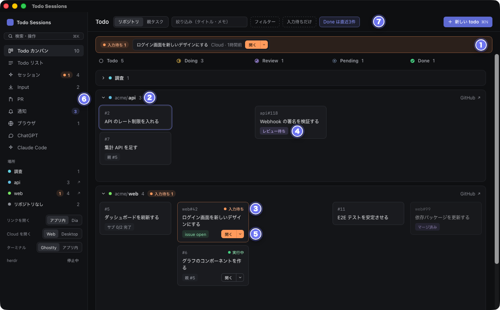

1. 入力待ちのセッションが上に並びます。「開く」でそのセッションに移れます
2. レーンです。リポジトリごとに分かれます（「親タスク」に切り替えると親の todo ごとになります）
3. 紐づいたセッションの状態（入力待ち・実行中・待機中）です
4. 紐づいた issue / PR の状態（レビュー待ち・マージ済みなど）です
5. セッションを開きます。▾ から開き方を選べます
6. サイドバーです。画面を切り替えたり、場所（リポジトリ）で絞り込んだりします
7. 絞り込みとフィルターです。名前を付けて保存しておけます

カードを列のあいだでドラッグすると、ステータスが変わります。同じ内容を1行ずつ並べた「Todo リスト」もあります。

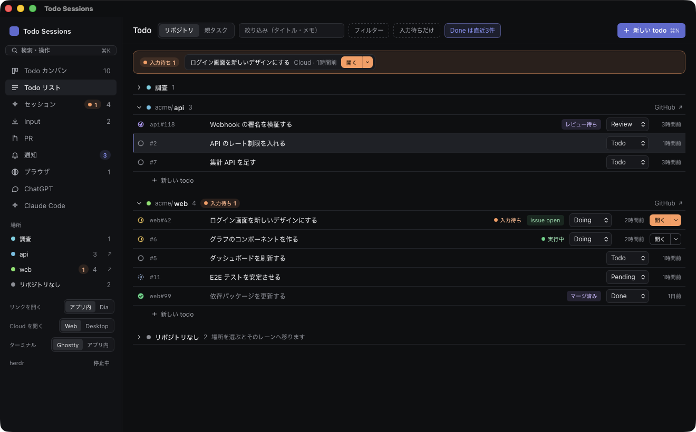

### todo のパネル（詳細とセッションの起動）

カードを押すか Enter で開きます。

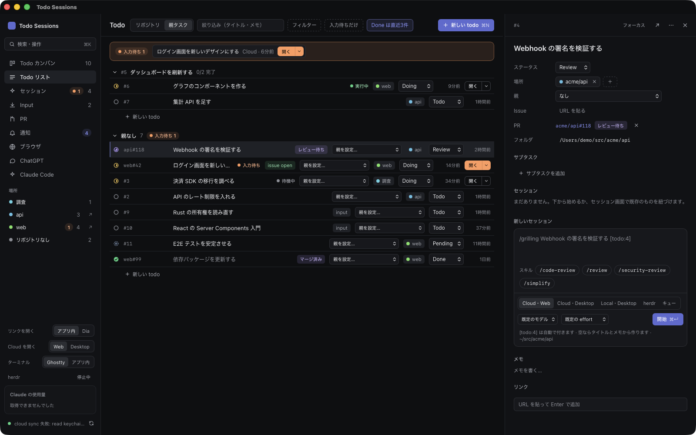

1. ステータス・場所（リポジトリ）・親の todo
2. issue / PR。`claude/todo-<id>-` のブランチで作られた PR は自動で紐づきます
3. サブタスク。全部 Done になると、親の todo も Done になります
4. 最初のプロンプト。`[todo:N]` は自動で付きます
5. スキル。よく使うものが先に並びます
6. 起動先。Cloud・Web / Cloud・Desktop / Local・Desktop / herdr / キュー から選びます（サイドバー左下の「ターミナル」をアプリ内にすると、herdr は「ターミナル」になります）
7. モデルと effort を選んで開始します（⌘Enter でも始まります）

開始すると、選んだ起動先でセッションが始まり、パネルの「セッション」に状態（実行中・待機中など）が出ます。

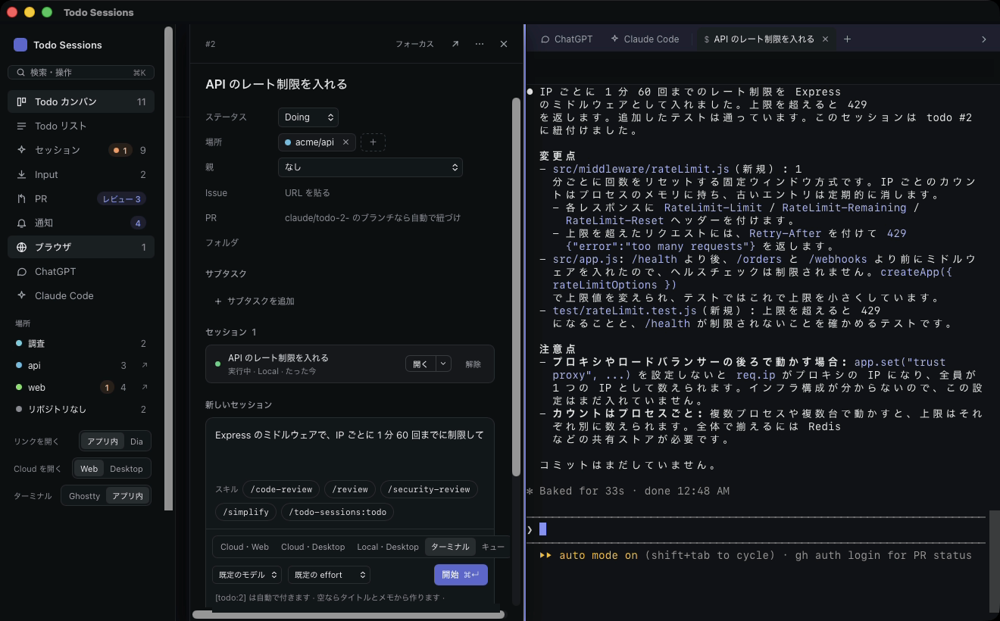

- ターミナル：右のペインのタブで claude が動きます（「ターミナル」を Ghostty にしているときは herdr の新しいワークスペースで動きます）
- Cloud・Web：claude.ai にセッションを作り、そのページを右のペインで開きます

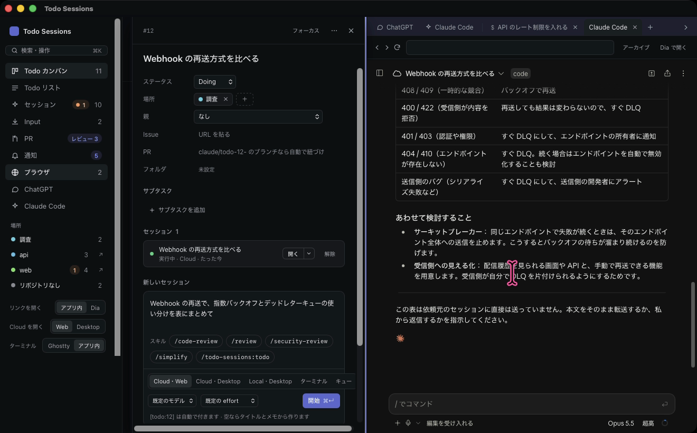

### セッション

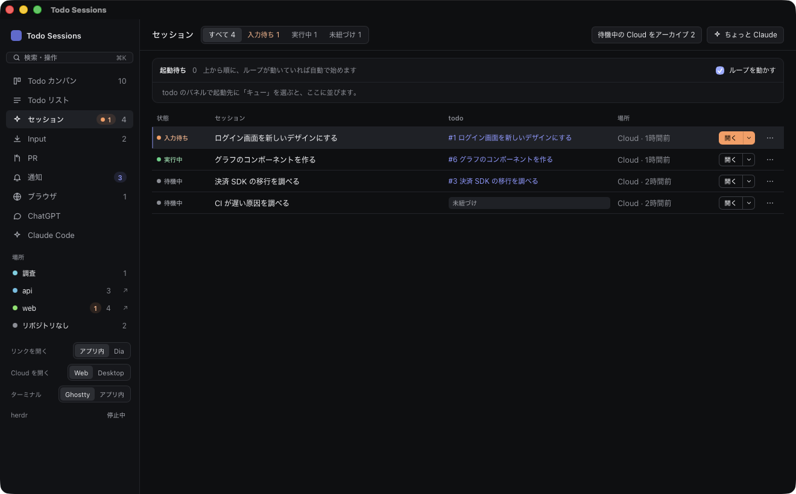

todo に紐づいたものも、紐づいていないものも、すべてのセッションを並べます。行を押すとそのセッションを開きます。

- 紐づいていないセッションは、ここで todo を作るか、既存の todo に紐づけます
- 上の「起動待ち」がキューです
- 待機中の Cloud セッションは、まとめてアーカイブできます

### PR

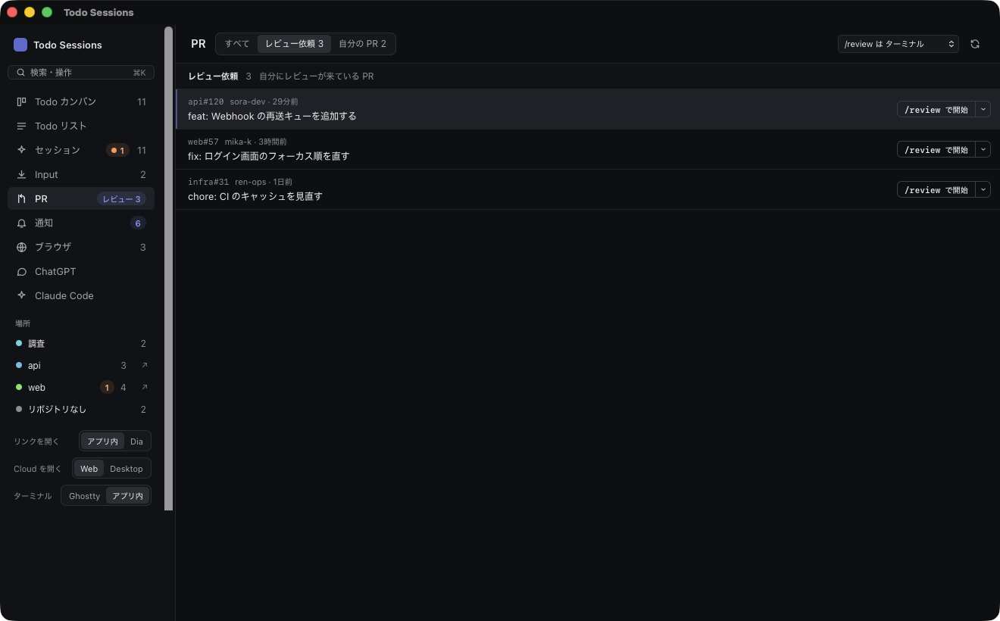

自分へのレビュー依頼と、自分の PR を並べます（`gh` で取得します）。

- j / k で選んで Enter を押すと、「提出前に確認して開始」か「自動で提出まで行う」を選んでレビューを始めます。todo は作りません
- レビューを始める場所（Cloud・Web / Cloud・Desktop / Local・Desktop / ターミナル）は、上のプルダウンで選びます
- 選んだ PR は右のペインで開きます。自分の PR は「todo にする」で todo にできます

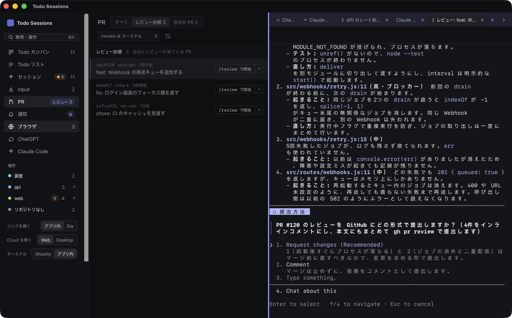

「提出前に確認して開始」では、claude が指摘をまとめたあと、どの形（Request changes / Comment など）で提出するかを聞いてきます。このあいだセッションは入力待ちになります。

### 通知

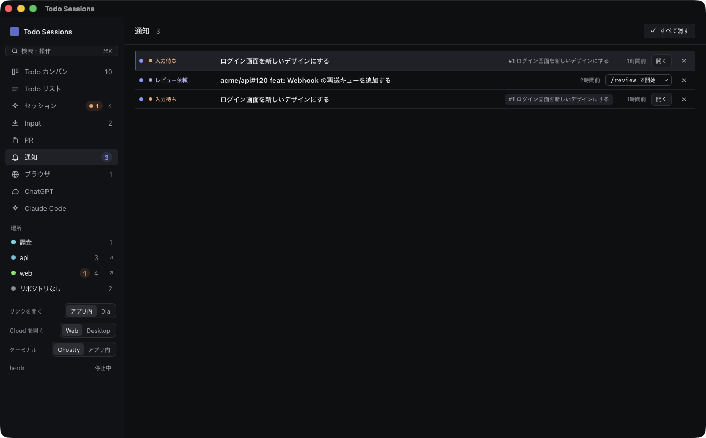

入力待ち・作業の完了・レビュー依頼のうち、まだ見ていないものが並びます。レビュー依頼は「/review で開始」を押すと、そのままレビューのセッションを始められます。j / k で選んで x で消せます。

### Input と Input モード

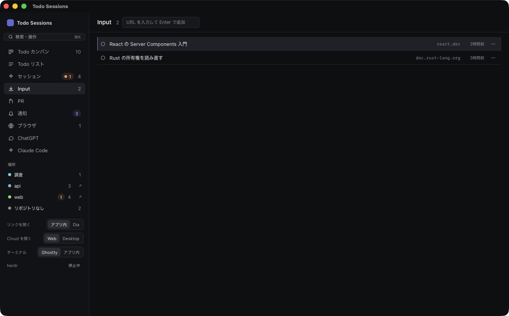

Input は、読みたい記事や本の章の一覧です。上の欄に URL を入れるか、アプリ内ブラウザでリンクを ⌥ + クリックすると追加されます。右上の「新しい input」や ⌘K の「新しい input」から、ダイアログで追加することもできます。先に input を作っておき、作業スペースで読んでいるページをアドレス欄の横の「Input に追加」から入れることもできます。URL をいくつか入れると1件にまとまります。開くと Input モードになり、その URL（いくつかあれば全部）が左に出ます。

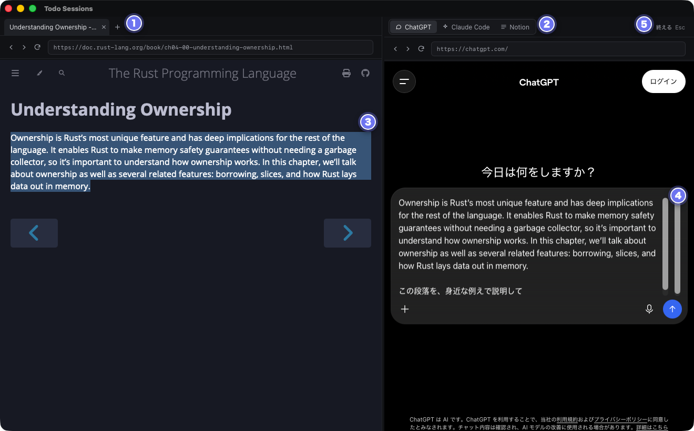

1. 左は読むページです。タブで何枚も開けます
2. 右は ChatGPT・Claude Code・Notion を切り替えて使います
3. 左で文章を選びます
4. ⌃L を押すと、選んだ文章が右の入力欄に入ります
5. 終えるときは Esc を2回押します

⌃H / ⌃L で入力先を左右に移し、⌘⇧[ ⌘⇧] でその側のタブを切り替えます。⌘K を押すと、Input モードを終えて ⌘K のメニューを開きます。

開いているページは input ごとに分かれていて、右の ChatGPT なども todo ごとに別の会話です。終えてもそのまま残り、次にその todo を開くと続きから始まります（Input の一覧に「続き」と出ます）。アプリを再起動しても、開いていたページから始まります。

右の「ノート」では、左のページを Claude が整理し直した、コメントできるノートを claude.ai に作れます。形は Docs・HTML・スライド・デザインから選べます。Docs のノートは、コメントで @Claude と書くと claude.ai の Claude が答えます。

Input モードのあいだは、アプリのショートカットと macOS の通知が止まります。左で開けるのは、選んだページのサイトと学習ページだけです。ほかのリンク（と ＋ で足す URL）は、今の作業に関係するかを TypeSafe の Jev が判定し、関係がありそうなら左に開き、薄ければその見込みを出して「開きますか？」と聞きます。判定のために、todo のタイトルとメモ、ページのタイトルと URL を TypeSafe に送ります。API キーは ⌘K の「Jev の API キーを設定」で入れます。

⌘K の「Input モード」から入るときは、最初に左に開くページを選びます。よく読むサイトは「学習ページ」として登録しておけます。

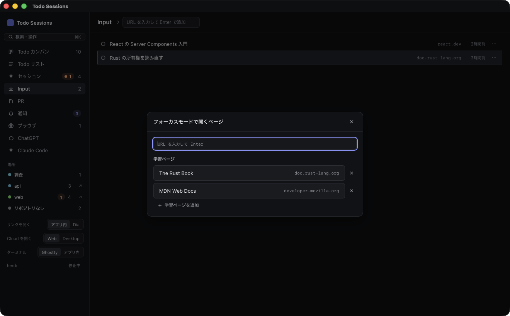

### アプリ内ブラウザ

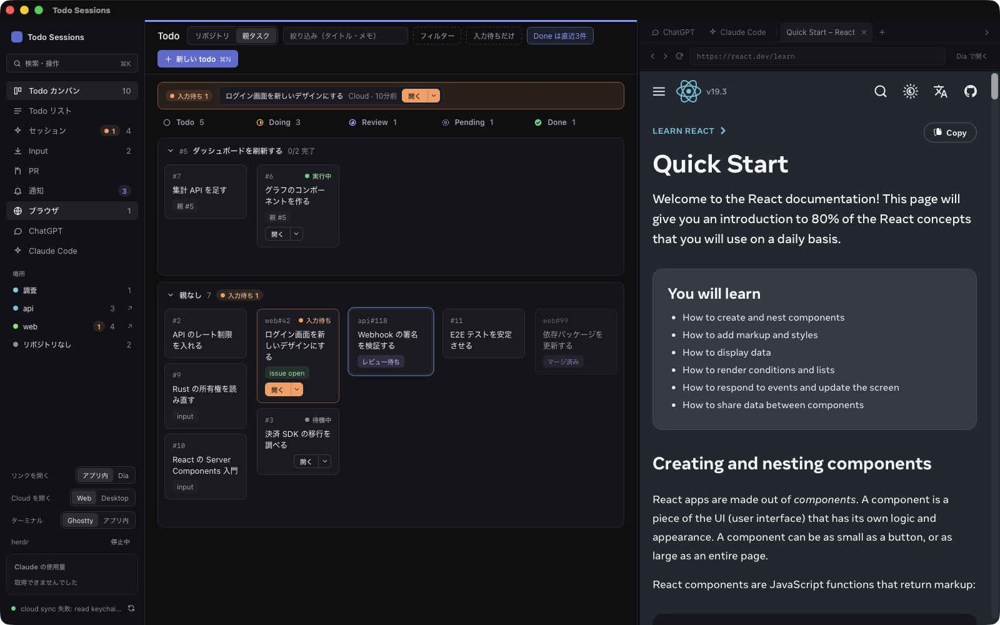

右側のペインにタブでページを開きます。issue / PR や Cloud セッションのページはここで開きます。ChatGPT と Claude Code は左端に常駐していて、閉じないので状態が保たれます。⌃H と ⌃L で、入力先を Todo 側とペインで切り替えます。

### ⌘K とショートカット

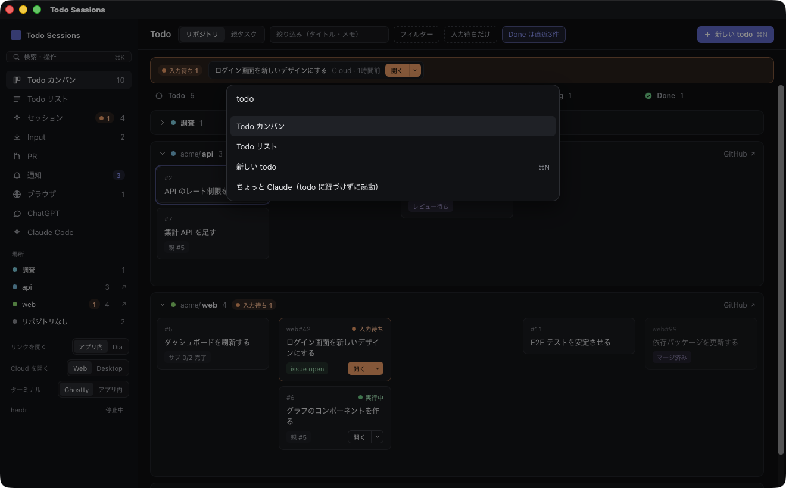

⌘K で、画面の移動や操作を探して実行できます。todo も検索できます。「session」「focus」のように英語で探しても見つかります。

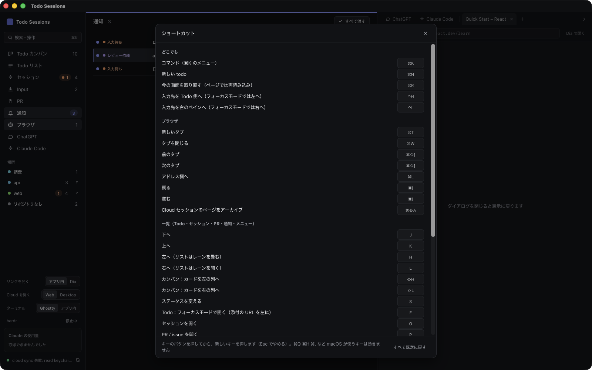

ショートカットは一覧から自分のキーに変えられます。

## よく使うキー

| キー | すること |
| --- | --- |
| ⌘K | コマンド（画面の移動・操作・todo の検索） |
| ⌘N | 新しい todo |
| j / k | 下へ / 上へ |
| h / l | 左の列 / 右の列（リストではレーンを畳む / 開く） |
| Enter | パネルを開く（Input の todo は Input モード） |
| s | ステータスを変える |
| ⇧H / ⇧L | カンバンで、カードを左 / 右の列へ動かす |
| o | セッションを開く |
| p | PR / issue を開く |
| f | todo のページを Input モードで開く |
| c | その場所に todo を追加 |
| / | 絞り込み欄へ |
| ? | キーの一覧 |
| ⌃H / ⌃L | 入力先を左（Todo 側）/ 右（ペイン）に移す |
| ⌘T / ⌘W | ブラウザのタブを開く / 閉じる |
| j / k（ブラウザのページ） | ページを下 / 上にスクロール（入力欄にいないとき） |

## 自動で行うこと

- クラウドのセッションを30秒ごと、GitHub を1分ごとに同期します
- PR にレビュー依頼が入るか Approve されると Review、修正を頼まれると Doing、マージされると Done にします（紐づいた issue も close します）
- issue が close されたら Done にします
- サブタスクが全部 Done になったら、親の todo も Done にします
- Done になった todo の Cloud セッションを、ターンが終わっていればアーカイブします
- 入力待ち・作業の完了・レビュー依頼を macOS の通知で知らせます

## はじめかた

macOS と Claude Code が必要です。GitHub との連携には、ログイン済みの [gh](https://cli.github.com/) を使います。インストールとアプリのビルドの手順は、README の「[インストール](../README.md#インストール)」と「[アプリ](../README.md#アプリ)」を見てください。
