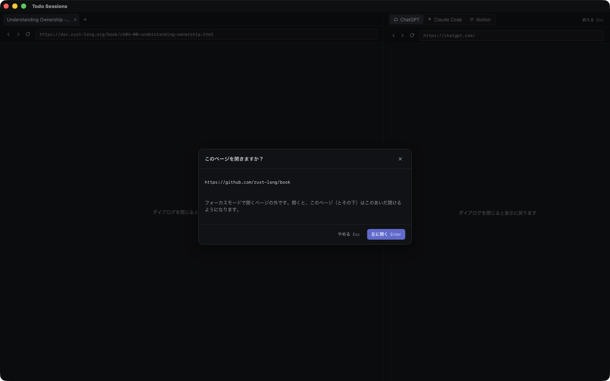
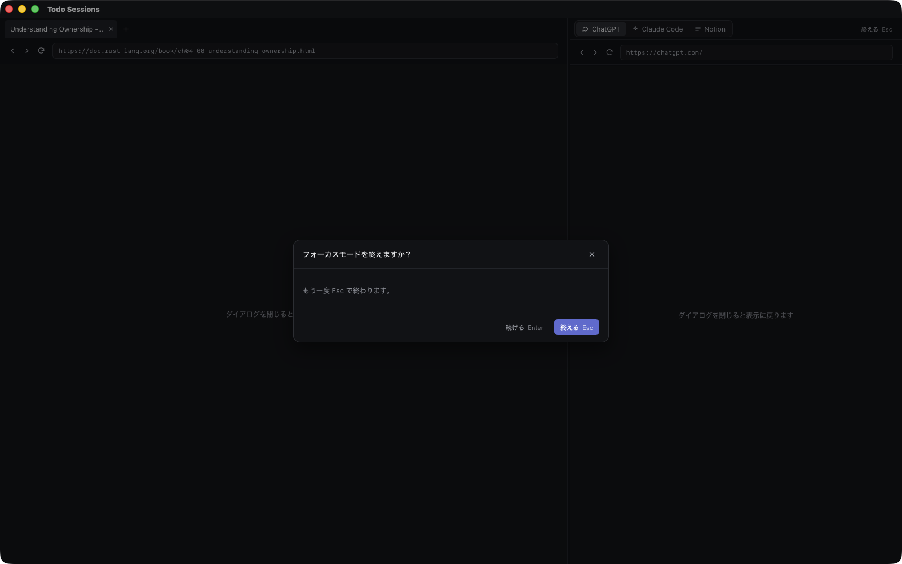

# Todo Sessions の機能紹介

todo や GitHub issue を Claude Code のセッション（CLI・Desktop の Code タブ・クラウド）に紐づけて、1つの画面で進み具合を追うための macOS アプリです。画像と動画はすべて架空のデモデータで撮っています。

## 紹介動画

[promo.mp4](promo.mp4)（約1分・音声なし）

## Todo

### カンバン

- Todo / Doing / Review / Pending / Done の5列です。カードを列のあいだで動かすと status が変わります
- リポジトリごと、または親タスクごとのレーンに分かれます
- 上の帯に入力待ちのセッションが並びます
- `claude/todo-<id>-` ブランチの PR やセッションの作業ブランチの PR を拾い、レビュー依頼で Review、マージで Done のように status を自動で進めます

### リスト

- 同じ todo を1行ずつ並べます。セッションと PR の状態が並び、親と status は行の中で変えられます
- 絞り込みとフィルターはカンバンとリストで別々に持ち、名前を付けて保存できます

### パネル

- カードを押すか Enter で開きます。タイトル・ステータス・場所・親・issue / PR・フォルダ・メモ・リンクをその場で編集できます
- 「新しいセッション」で最初のプロンプトを書き、スキル・起動先（Cloud・Local・herdr・キュー）・モデル・effort を選んで始めます。プロンプトに `[todo:<id>]` が入り、始まったセッションが自動で紐づきます

### キーボード

- j k / ↑↓ で移動、h l で左右の列（リストはレーンの折りたたみ）、Enter でパネル、s でステータス、⇧h ⇧l でカードを左右の列へ、o でセッション、p で PR、u で親、f でフォーカスモード、c で追加、/ で絞り込み、? で一覧です
- ⌃h でサイドバーに移り、j / k と Enter で画面を切り替えます

## セッション

- todo に紐づいたものも紐づいていないものも、Cloud と Local のセッションを一覧にします
- 行を押すか Enter でセッションを開きます（Cloud は claude.ai の Web か Desktop、Local は herdr・アプリ内のターミナル・Desktop）
- 上の「起動待ち」がキューです。キューに入れた todo を順に起動します
- 待機中の Cloud セッションをまとめてアーカイブできます

## Input

- 読みたい記事や本の章を todo（タグ input）として並べます
- 上の欄に URL を入れるか、アプリ内ブラウザでリンクを ⌥ + クリックすると追加されます。URL をいくつか入れると 1 件にまとまります
- 開くとフォーカスモードになり、その URL（いくつかあれば全部）が左に出ます

## 通知

- 入力待ち・作業が終わったとき・レビューを頼まれたときの通知のうち、まだ見ていないものが並びます
- レビュー依頼は「/review で開始」で、todo を作らずにレビューのセッションを始めます
- j / k で選んで x で消せます

## ⌘K とショートカット

- ⌘K で画面の移動、issue の取り込み、同期などの操作と todo を検索します。「session」「focus」のような英語でも見つかります

- ショートカットは一覧から自分のキーに変えられます。アプリ内ブラウザのページの中でも同じキーが効きます

## アプリ内ブラウザ

- 右側のペインにタブで開きます。issue / PR のチップ、PR の行、Cloud セッションの「開く」はここで開きます
- ChatGPT と Claude Code はタブ列の左端に常駐し、閉じないので状態が保たれます
- ⌃h / ⌃l で入力先を Todo 側とペインで切り替えます。入力先の側は色の線で分かります
- 設定で、Local のセッションをペインのターミナルタブ（見た目とキーは Ghostty の設定に合わせます）で動かせます

## フォーカスモード

- サイドバーと Todo 側を隠し、左に読むページ、右に ChatGPT（Claude Code・Notion に切り替え可）を並べます
- 左で文字を選んで ⌃l を押すと、その文字が右の入力欄に入ります
- フォーカスモード中はアプリのショートカットと macOS の通知を止めます。終えたときに、そのあいだの通知の件数を知らせます

- 入るときに左に開くページを選びます（URL・学習ページ・ペインのターミナル）。todo の f からは、その todo のリンク・PR・issue を全部左に開きます

- 左で開けるのは、選んだページのサイトと学習ページだけです。ほかのリンク（と ＋ で足す URL）は、今の作業に関係するかを TypeSafe の Jev が判定し、関係があれば左に開き、薄ければその見込みを出して「開きますか？」と聞きます（API キーは ⌘K の「Jev の API キーを設定」で入れます）

- Esc で「終えますか？」が出て、もう一度 Esc で終わります（Enter で続ける）
